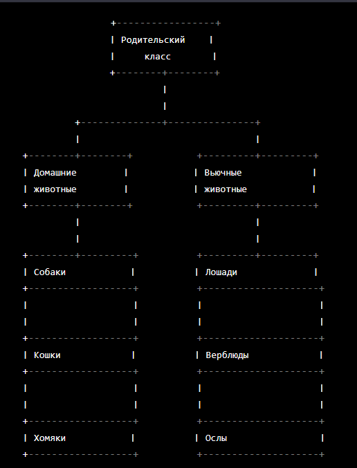

1. ```bash

   cat > "Домашние животные" << EOF
   Собаки
   Кошки
   Хомяки
   EOF

   cat > "Вьючные животные" << EOF
   Лошади
   Верблюды
   Ослы
   EOF

   cat "Домашние животные" "Вьючные животные" > "Совмещённый файл"

   cat "Друзья человека"
   Собаки
   Кошки
   Хомяки
   Лошади
   Верблюды
   Ослы

   mv "Объединённый файл" "Друзья человека"
   ```

2. ```bash
   mkdir Final_control_work
   mv "Друзья человека" Final_control_work/
   ```

3. ```bash
    wget wget https://dev.mysql.com/get/mysql-apt-config_0.8.25-1_all.deb
    dpkg -i mysql-apt-config_0.8.25-1_all.deb
    apt update
    apt install mysql-server
   ```

4. ```bash
    wget https://dlcdn.apache.org//directory/apacheds/dist/2.0.0.AM26/apacheds-2.0.0.AM26-amd64.deb
    dpkg -i apacheds-2.0.0.AM26-amd64.deb
    dpkg -P apacheds
   ```

5. Done
6. <br>

    <br>

Задания с 7 по 12 [Файл с SQL скриптом](sql/animals.sql) <br>
Задания с 13 по 14 [JavaAPP](app/)
